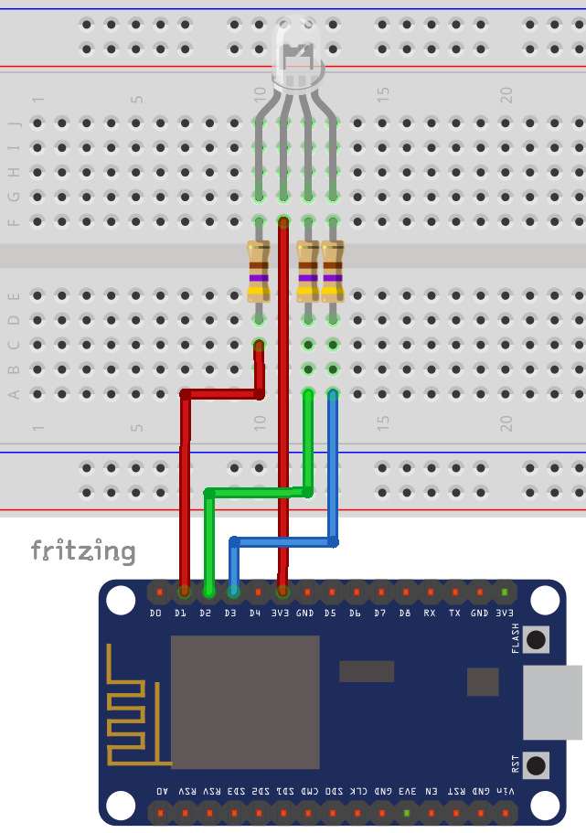
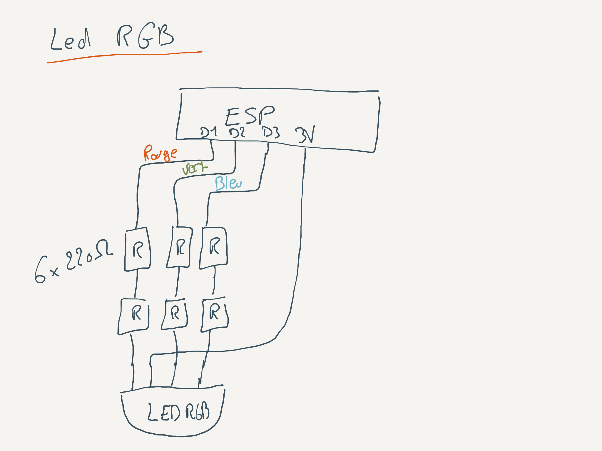

<!---->

# ESP RGB LED WIFI

## Présentation 

Projet réalisé pendant les mob day's #005 de La Mobilery par l'équipe domotisation.

Ce projet a pour but de pouvoir allumer, éteindre et changer la couleur d'une LED RGB à distance grâce à un ESP 8266.

## Réalisation

### Schéma électrique

<center>

</center>

Dans notre réalisation, nous avons utiliser 6 resistances de 220 ohm.

<center>

</center>

### Configuration du Wifi

La configuration du wifi se fait dans le fichier `webServerManager.h` en complétant la valeur de chaque attribut : 

```c+++ 
const String ssid = "[SSID_A_COMPLETER]";
const String password = "[PASSWORD_A_COMPLETER]";
```

Les fichiers : `webServerManager.h` et `webServerManager.cpp` ainsi que l'implémentation générale du fichier `ESP_RGB_LED_Wifi.ino` proviennent du projet des mob day's #004.

> https://github.com/JorisLefait/ESP8266-light-pressure

### Gestion du RGB

Le code pour interagir avec la LED RGB se trouve dans la classe `LedRgbManager`.

La liaison entre le manager RGB et la gestion des requêtes http se fait dans le fichier principal : `ESP_RGB_LED_Wifi.ino`.

```c++
#include "LedRgbManager.h"

LedRgbManager rgbLedManager = LedRgbManager() ;
```

```c++
void initRootUrls() {
	// ...

  // LED RGB
  server.on(URL_POST_COLOR_LIGHT, std::bind(&LedRgbManager::handleColorLedRgb, rgbLedManager));
}
```

il faut initialiser le manager RGB qui va définir les PIN GPIO comme étant des sorties en appelant la méthode dédiée dans le setup.

```c++
void setup() {
  // ...
  
  // on configure la led rgb
  rgbLedManager.initManager();
}
```

## Utilisation

### Requête

Attention : dans le CURL suivant, l'IP est `192.168.1.35` mais il faudra changer par l'IP de l'ESP affichée sur la console lors du démarage de ce dernier.

```curl
curl -X POST \
  http://192.168.1.35/api/led_rgb \
  -H 'Content-Type: application/x-www-form-urlencoded' \
  -H 'Postman-Token: 8805d674-8f08-458d-8412-e925e6b3ad94' \
  -H 'cache-control: no-cache' \
  -d 'embedded_led_rgb_api_key=iYCFjYE4tTnpiJJ6psf4axjTN&red=1&green=0&blue=0'
```

### Combinaisons possibles

Les paramètres de la requête `red`, `green` et `blue` peuvent être changés comme ci-dessous pour obtenir la couleur désirée.

* Eteins : red = `0`, green = `0`, blue = `0` 
* Bleu : red = `0`, green = `0`, blue = `1`
* Vert : red = `0`, green = `1`, blue = `0`
* Cian : red = `0`, green = `1`, blue = `1`
* Rouge : red = `1`, green = `0`, blue = `0`
* Violet : red = `1`, green = `0`, blue = `1`
* Jaune : red = `1`, green = `1`, blue = `0`
* Blanc : red = `1`, green = `1`, blue = `1`


